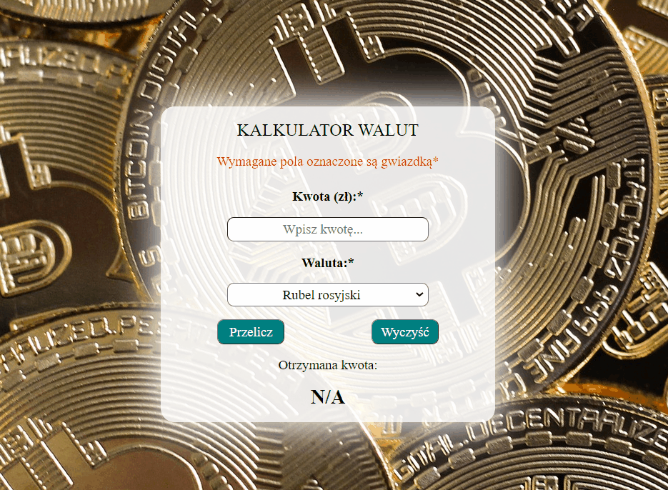

# currency-calculator

# Description

In this application you can convert PLN value to three other currencies, russian rubles, brazilian reales and japanese yen.

Exchange rates are based on data from https://www.money.pl/pieniadze/kalkulator/ 

# 

# Demo 

https://mieczyslawfrontdev.github.io/currency-calculator/

# Technologies

- HTML
- CSS
- Flexbox
- Javascript
- BEM
- ES6+ (Features)
